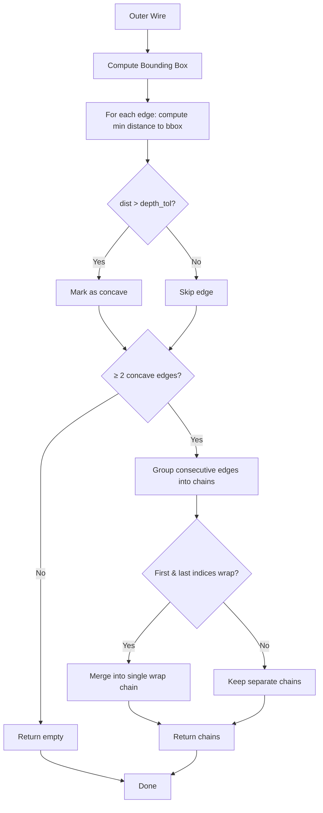

# Design Document — CAM-JetCutting

Architecture, algorithms, and FreeCAD integration details for the JetCutter Tools addon.

---

## Table of Contents

1. [Architecture](#architecture)
   - [Addon bootstrap](#addon-bootstrap)
   - [Workbench manipulator pattern](#workbench-manipulator-pattern)
   - [Command registration flow](#command-registration-flow)
2. [SameEdgesAsHighlighted](#sameedgesashighlighted)
   - [Algorithm overview](#algorithm-overview)
   - [Matching criteria](#matching-criteria)
   - [Visibility traversal](#visibility-traversal)
   - [Complexity](#complexity-1)
3. [FindProfiles](#findprofiles)
   - [Algorithm overview](#algorithm-overview-1)
   - [Top face detection](#top-face-detection)
   - [Edge matching via hashCode](#edge-matching-via-hashcode)
   - [Closed loop detection](#closed-loop-detection)
   - [Profile operation creation](#profile-operation-creation)
   - [Concave indentation detection](#concave-indentation-detection)
   - [Wire-closed validation](#wire-closed-validation)
   - [Complexity](#complexity-2)
4. [Constants & Configuration](#constants--configuration)

---

## Architecture

### Addon bootstrap

FreeCAD's addon loader (`DirModGui` in `FreeCADGuiInit.py`) discovers addons by looking for `InitGui.py` at the package root. It has no mechanism for discovering workbench manipulators registered from within a namespace package (`freecad.jetcutter_tools.init_gui`).

The bootstrap chain:

```
package.xml <workbench> tag
    → DirModGui.process_metadata() reads metadata
    → FreeCADInit.py ExtModScanner scans freecad.* namespace
    → BUT: DirModGui.run_init_gui() only runs InitGui.py at addon root
    → InitGui.py (shim) imports freecad.jetcutter_tools.init_gui
    → init_gui.py registers commands + manipulator
```

**File:** `InitGui.py` — a 2-line shim that imports the real module.
**File:** `freecad/jetcutter_tools/init_gui.py` — registers two commands and the manipulator.

### Workbench manipulator pattern

The addon uses FreeCAD's **Workbench Manipulator** API (introduced in FreeCAD 1.1) to contribute a custom toolbar to the existing CAM Workbench, rather than defining a full workbench.

```
Manipulator.modifyToolBars()
    ├── Called by FreeCAD when the target workbench activates
    ├── Checks if current workbench == "CAMWorkbench"
    ├── Returns list of toolbar modification dicts:
    │   ├── {"append": "JetCutter Tools", "toolBar": ""}      → creates toolbar
    │   ├── {"append": "JetCutter_SameEdges", "toolBar": "JetCutter Tools"}
    │   └── {"append": "JetCutter_FindProfiles", "toolBar": "JetCutter Tools"}
    └── First call creates the toolbar; subsequent calls append commands
```

The `active_workbench_name()` helper works around a FreeCAD quirk: `FreeCADGui.activeWorkbench().name()` raises `AttributeError` during a core workbench's first activation. The name is recovered by identity comparison against `FreeCADGui.listWorkbenches()`.

### Command registration flow

```
init_gui.py
    ├── FreeCADGui.addIconPath("Resources/Icons")
    ├── FreeCADGui.addCommand("JetCutter_SameEdges", SameEdgesAsHighlighted())
    ├── FreeCADGui.addCommand("JetCutter_FindProfiles", FindProfiles())
    └── FreeCADGui.addWorkbenchManipulator(Manipulator())
```

Each command class implements the FreeCAD `Gui::Command` interface:
- `IsEnabled()` — determines if the button is active (depends on selection state)
- `Activated()` — executes the command logic
- `GetResources()` — returns icon name, menu text, and tooltip

---

## SameEdgesAsHighlighted

### Algorithm overview

Finds and selects all edges across all visible solids in the active document that match a **template profile** defined by the user's initial edge selection.

```
1. User selects one or more edges on any visible solid
2. Extract template: list of (edge_length, edge_Z) pairs from selected edges
3. Compute average Z-level from all selected edges
4. Clear selection
5. For each document object (excluding groups/parts):
   a. Skip if not visible (ancestor chain check)
   b. For each edge in the object's shape:
      i.   Check if edge Z ≈ average template Z (tolerance: 0.001mm)
      ii.  Check if edge length matches ANY template edge length (tolerance: 0.001mm)
      iii. If both match, add to selection
6. Report total matched edges
```

### Matching criteria

Two conditions must both be satisfied for an edge to match:

| Criterion | Method | Tolerance |
|-----------|--------|-----------|
| **Z-level** | `edge.CenterOfMass.z` vs `avg_target_z` | 0.001 mm |
| **Length** | `edge.Length` vs each `target["length"]` | 0.001 mm |

The Z-level check is a single comparison against the **average** Z of all selected template edges. This allows the user to select edges at slightly different Z positions (e.g. angled cuts) and still match.

The length check is an **any-match** against all template edge lengths. If the user selects 3 edges with lengths [10, 15, 20], any edge matching **any** of those lengths (at the correct Z) will be selected.

### Visibility traversal

The `is_effectively_visible()` function implements a recursive ancestor chain check:

```
is_effectively_visible(obj, gui_doc, visited):
    ├── Cycle detection: if obj in visited, return True (prevent infinite recursion)
    ├── GUI visibility: if obj.ViewObject.Visibility == False, return False
    └── Ancestor chain: for each obj in obj.InList:
        └── Recursively check ancestor; if any is invisible, return False
    └── Return True (all ancestors visible)
```

This ensures that an object hidden inside an invisible parent group is not processed, even if its own visibility flag is True.

**Complexity:** O(V × A) where V = visible objects, A = max ancestor chain depth.

### Complexity

| Phase | Complexity | Notes |
|-------|------------|-------|
| Template extraction | O(S) | S = number of selected sub-elements |
| Document traversal | O(D × E) | D = document objects, E = edges per object |
| Edge matching | O(E × T) | T = number of template edges |
| Visibility check | O(V × A) | V = visible objects, A = avg ancestor depth |
| **Total** | **O(D × E × T + V × A)** | Dominated by edge scanning |

With typical CAM models (D ≈ 50, E ≈ 1000, T ≈ 5), this runs in well under a second.

---

## FindProfiles

### Algorithm overview

Creates CAM Profile operations for **internal edges** (holes, cutouts) on the top faces of a selected CAM Job's model. Optionally detects and creates operations for **concave indentations** in the outer wire.

```
1. User selects a CAM Job object
2. Dialog: configure Tool, Offset Side, Cut Direction, LeadInOut, Concave Detection
3. Locate Model folder in Job.OutList
4. Extract first model clone (LinkedObjectGroup with Shape)
5. Build source edge hash map: hashCode → index for all source edges
6. Find top-facing flat faces on model (normal.z > 0.99)
7. For each top face:
   ├── For each inner wire (closed, not outer boundary):
   │   ├── Match wire edges to source edges via hashCode
   │   ├── If ≥ 2 edges matched: create Profile operation
   │   └── Increment closed_loop_count
   └── If concave detection enabled:
       ├── Compute bounding box of outer wire
       ├── Find concave edge chains (edges deep inside bbox)
       ├── Validate chains don't form closed wires
       └── Create Profile operation for each valid chain
8. Commit transaction, recompute document
```

### Top face detection

A face is considered "top-facing" if its normal vector has a Z-component greater than 0.99:

```
for face in source_obj.Shape.Faces:
    u_min, u_max, v_min, v_max = face.ParameterRange
    u_mid = u_min + (u_max - u_min) / 2.0
    v_mid = v_min + (v_max - v_min) / 2.0
    normal = face.normalAt(u_mid, v_mid)
    if normal.z > 0.99:
        → top face
```

The threshold 0.99 (instead of 1.0) allows for slight face tilts. The face midpoint is sampled because FreeCAD faces may have varying normals across their surface (though for planar faces, any point suffices).

### Edge matching via hashCode

The model clone's edges are geometrically identical to the source object's edges but have different memory addresses. FreeCAD's `hashCode()` method provides a stable identifier for edges that is consistent across geometrically identical edges.

```
src_hash_to_index = {e.hashCode(): i for i, e in enumerate(source_edges)}

for wire_edge in wire.Edges:
    src_idx = src_hash_to_index.get(wire_edge.hashCode())
    if src_idx is not None:
        edge_names.append(f"Edge{src_idx + 1}")
```

This maps each wire edge back to its corresponding edge on the model clone by index. The resulting `edge_names` list (e.g. `["Edge1", "Edge3", "Edge7"]`) is used to assign the correct sub-elements to the Profile operation's `Base` property.

**Why hashCode and not geometric comparison?** HashCode is O(1) lookup vs O(N) geometric comparison per edge. For large models with thousands of edges, this is a significant optimization.

### Closed loop detection

For each top face, the algorithm iterates over all wires:

```
outer_hash = face.OuterWire.hashCode()
for wire in face.Wires:
    if wire.hashCode() == outer_hash:
        continue          # skip outer boundary
    if not wire.isClosed():
        continue          # only process closed loops
    → process as internal hole/cutout
```

Only **closed** inner wires are processed. Open wires (e.g. scratches, artifacts) are skipped. The outer boundary wire is explicitly excluded.

### Profile operation creation

Extracted into a shared factory function `create_profile_operation()` (commands.py:577). This function is called by both the closed-loop and concave-chain code paths.

```
create_profile_operation(op_name, job, tool_controller, edge_names, model_clone,
                         offset_side, cut_direction, leadIn, leadOut, styleIn, styleOut,
                         lengthMultiplier):
    ├── PathProfileOp.Create(op_name, parentJob=job)
    ├── Set ToolController
    ├── Set ViewObject.Proxy (with setDeleteObjectsOnReject(False))
    ├── Build Base: [(model_clone, [edge_name, ...])]
    ├── Set Direction, Side/UseComp, heights
    ├── Call add_leadinout_dressup()
    └── Return profile_op or None
```

The `Base` property format is a list of `(DocumentObject, [sub-element names])` tuples. FreeCAD expects this structure to associate geometric sub-elements with the operation.

**Offset side logic:**

| offset_side | UseComp | Side | Meaning |
|-------------|---------|------|---------|
| `"None"` | `False` | — | No edge offset (cut on geometry) |
| `"Inside"` | `True` | `"Inside"` | Compensate inward (kerf correction) |
| `"Outside"` | `True` | `"Outside"` | Compensate outward (kerf correction) |

### Concave indentation detection

Concave indentations are recessed features on the outer boundary of a part — think a "C" shape cut into a rectangular edge, or a series of notches. The algorithm detects these by finding chains of edges that extend significantly inward from the bounding box.

#### Step 1: Bounding box computation

```
bb_min_x = bb_min_y = +∞
bb_max_x = bb_max_y = -∞
for edge in outer_wire.Edges:
    for vertex in edge.Vertexes:
        bb_min_x = min(bb_min_x, vertex.X)
        bb_max_x = max(bb_max_x, vertex.X)
        bb_min_y = min(bb_min_y, vertex.Y)
        bb_max_y = max(bb_max_y, vertex.Y)
```

#### Step 2: Concave edge identification

For each edge, compute its minimum distance to the bounding box boundary:

```
dist = min(
    v.X - bb_min_x,           # distance from left edge
    bb_max_x - v.X,           # distance from right edge
    v.Y - bb_min_y,           # distance from bottom edge
    bb_max_y - v.Y,           # distance from top edge
)
if dist > concave_depth_tol:
    → edge is concave
```

An edge is classified as concave if **any** of its vertices lies deeper than `concave_depth_tol` (default 5mm) inside the bounding box. This captures edges that "recess" into the part.

#### Step 3: Chain formation

Consecutive concave edges are grouped into chains:

```
concave_indices = [0, 1, 2, 7, 8, 9, 10]

current_chain = [0]
for j in 1..len(concave_indices):
    if concave_indices[j] == concave_indices[j-1] + 1:
        current_chain.append(concave_indices[j])  # consecutive
    else:
        if len(current_chain) >= 2:
            chains.append([edges[idx] for idx in current_chain])
        current_chain = [concave_indices[j]]  # start new chain
if len(current_chain) >= 2:
    chains.append([edges[idx] for idx in current_chain])
```

Minimum chain length is 2 edges — a single concave edge is not considered a meaningful indentation.

#### Step 4: Wrap-around detection

If the first and last concave indices form a continuous chain across the wire boundary (last edge → first edge), they are merged into a single chain:

```
if concave_indices[0] == len(edges) - 1 and concave_indices[1] == 0:
    chains = [wrap_chain]  # replace all chains with the wrap chain
```

#### Visual representation

```
Bounding box: ┌─────────────────────────┐
              │                         │
              │    ┌───┐               │
              │    │   │               │
              │    └───┘               │
              │                         │
              └─────────────────────────┘

Concave edges (●) inside bbox:
  ┌─────────────────────────┐
  │                         │
  │  ┌───●●●●●●───┐         │
  │  │           │         │
  │  └───────────┘         │
  │                         │
  └─────────────────────────┘

Chain: ●●●●● → 1 concave indentation
```

#### Mermaid diagram — concave detection flow



### Wire-closed validation

Concave chains are validated to ensure they don't form closed wires (which would be mishandled as open profiles):

```
matched_edges = [model_clone.Shape.getElement(name) for name in edge_names]
test_wire = Part.Wire(Part.__sortEdges__(matched_edges))
if test_wire.isClosed():
    skip  # closed wire — handled as regular loop instead
```

`Part.__sortEdges__()` orders the edges into a valid wire sequence. If the resulting wire is closed, the chain is skipped because it represents a complete loop (already handled by the closed-loop detection above).

### Complexity

| Phase | Complexity | Notes |
|-------|------------|-------|
| Hash map construction | O(E) | E = source edges |
| Top face detection | O(F) | F = faces per model |
| Wire iteration | O(W × E_w) | W = wires per face, E_w = edges per wire |
| Edge matching | O(E_w) | O(1) hashCode lookup per edge |
| Concave detection | O(E_outer) | E_outer = outer wire edges |
| Chain formation | O(C) | C = concave edges |
| Wire validation | O(E_chain) | Sorting + wire construction |
| **Total per face** | **O(E_total)** | Linear in total edge count |

The algorithm is efficient because hashCode lookups are O(1) and each edge is processed a constant number of times.

---

## Constants & Configuration

### Tolerance values

| Constant | Value | Purpose |
|----------|-------|---------|
| Edge matching tolerance | 0.001 mm | Length and Z-level comparison |
| Top face normal threshold | 0.99 | Allow slight face tilt |

### Default cutting parameters (mm)

| Parameter | Value | Purpose |
|-----------|-------|---------|
| ClearanceHeight | 5.0 | Rapid travel Z above workpiece |
| SafeHeight | 3.0 | Linear travel Z |
| StartDepth | 0.0 | Cutting start Z |
| StepDown | 1.0 | Depth per pass |
| FinalDepth | -2.0 | Final cut depth (negative = below surface) |

### Dialog defaults

| Setting | Default | Purpose |
|---------|---------|---------|
| Lead In | Enabled | Add lead-in to toolpath |
| Lead Out | Disabled | Add lead-out to toolpath |
| Lead In/Out Style | "Perpendicular" | Entry/exit angle |
| Length Multiplier | 3.0 × tool diameter | Lead length |
| Concave Detection | Enabled | Detect concave indentations |
| Concave Depth Tol | 5.0 mm | Min depth for concave classification |
